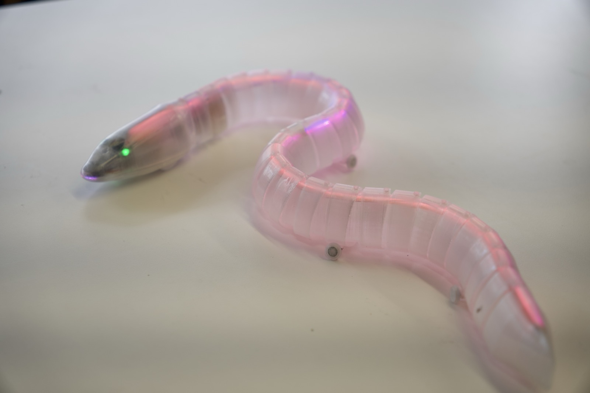

# Jaha Koo Eel

A robotic remote controlled eel. A prop for the play [Haribo Kimchi](https://www.campo.nu/en/production/24342/haribo_kimchi).

A collaboration between [Adriaan Wormgoor](http://adriaanwormgoor.nl) and [Willem Vooijs](https://willem.vooijs.eu), produced for [Innovation:Lab Theater Utrecht](https://www.theaterutrecht.nl/innovationlab) and [Campo](https://campo.nu).

## Manual
* [Operator Manual](doc/Haribo%20Kimchi%20Eel%20-%20operator%20manual.pdf)

## Build your own
* [Bill of Materials](./BOM.md)
* [Schematics](doc/Haribo%20Kimchi%20Eel%20-%20tech%20stuff%20-%20visual%20schematic%20and%20pinout.pdf)
* [Code](./arduino/README.md)
* [PCB designs](./kicad/README.md)
* [PCB designs](./kicad/README.md)
* [PCB designs](./kicad/README.md)

